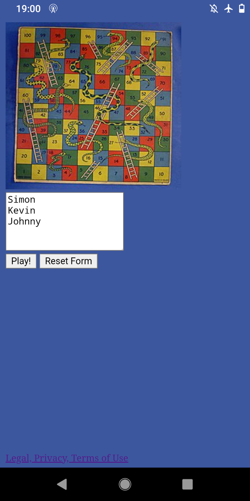
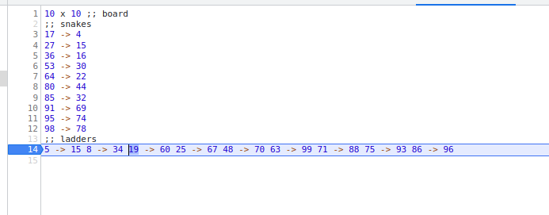

# Snakes and Ladders

 

## TL;DR

Just play and see:
https://alex028502.github.io/snakes-and-ladders/

All of the source maps are available if you want to know how it works.
It works offline once you refresh a couple times. Add it to you home screen
for a full screen experience.

## Tech

This project is mainly about tooling. Well, is is mainy about automation, and
saving time, but it is also about tooling, and learning a bit of clojure.

### Snakes and Ladders Engine

The [engine](./src/engine/core.cljc) is written in clojurescript. I tried to
keep all the functional stuff in clojurescript, and all the messy stuff in js.

The engine can be developed in a clojure repl since it has nothing clojurescript
specific.

It was inspired by this episode:
https://clojuredesign.club/episode/002-tic-tac-toe-state-in-a-row/
or maybe the episode after.

### Snakes and Ladders Engine Tests

I usually try to test everything end to end when possible. However, in this
project, it was very important to do my best to guarantee that the users are
playing the game they think they are playing, so I tested the engine like
[this](./src/engine/core_test.cljs).  This test can be run in clojure or
clojurescript. In development, I found it a lot easier to run it with clojure,
but CI runs it both ways to prove that it is compatible.

### Javascript Glue

All the glueing together, mutating, generating random numbers.. messy stuff..
is done [here](src/index.js) in javascript.

[These functions](./src/engine/convert.cljs) convert arrays, objects, and
generators into clojurescript types so that the core program doesn't have to
know anything about where it is running.

### Board

The board is configured using a
[DSL](./src/board.snlbddsl) that I made up.  The [transpiler](./snlbddsl)
is written in Flex and Bison, but then [javascript](./snlbddsl/sm.js) is used
to extract the source map info.

I really just wanted to try out what I read in this book:

The cool part is being able to step through your own language with browser
dev tools like this:

### Selenium Tests

The [Selenium Tests](./selenium/Test.java) are written in Java. I looked into
writing them in Clojure, but nobody in my top few duckduckgo results seemed too
enthusiastic about that.

I would normally choose to write selenium tests in Python or sometimes JS, and
any time I've used Java ones before, they have been part of a big junit maven
project. I wanted to do something more light weight, so I just used shadow
cljs to download the selenium library, and compiled a java class with a simple
test in static methods.  The test only makes sense with this
[wrapper script](./test.sh).

The selenium test can make sure a lot of stuff is hooked up correctly, like
buttons, and local storage. It also tells me that the service worker is caching.
Since the wrapper script starts the server, I just made it shut off after 10
seconds, when the tests last about 20 seconds, so if the service worker caching
isn't working, the test fails when it tries to reload the page.

The Selenium tests only work after the app is compiled.

### Integration Tests

Since the selenium tests can't really tell us if the game is being played
fairly, and the snakes and ladders engine tests don't check the real board,
there is an additional set of [tests](./test.js) that take the compiled engine,
the compiled board, and a rigged die, and make sure that a lot of stuff works as
expected.  This might seem like overkill, but since the users are blindly
trusting us to give them a fair game, we have to go that extra mile.

### Bundling

I am using [esbuild](https://github.com/evanw/esbuild) to bundle together the
javascript glue code, the random number generator, and then board. The board
needs to be transpiled first. I tried using webpack, but it seemed to have
trouble combining the imperfect source maps for the board. I couldn't set
breakpoints. esbuild worked the first time.

The engine is not bundled in with the rest, so that I can take
advantage of more shadow cljs features. Also, if I am working on the ui, the
engine doesn't really have to change, and I can recompile afterthing else in
under a second. The two have totally different "release cycles", so this works
great.

### Test Coverage

Almost all my projects have 100% test coverage.  In this project, I didn't know
how to measure test coverage for clojure.  However, I still made a point of
covering every possible branch, and deleted the branches I couldn't test.
